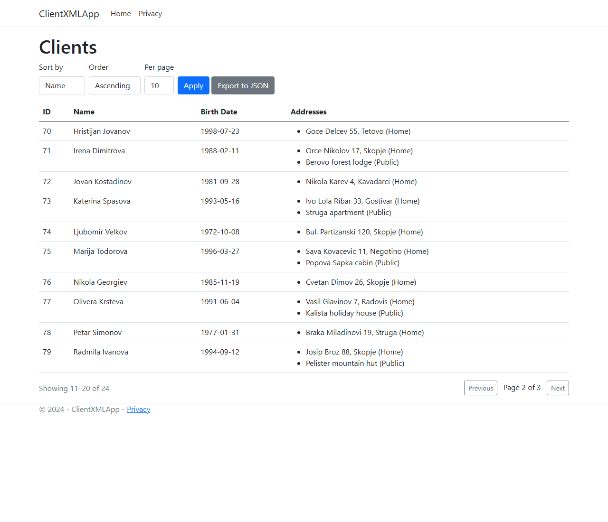

# ClientXMLApp

An ASP.NET Core Razor Pages application for importing client records from XML and managing them
against SQL Server. Clients arrive either through a web form or as an uploaded XML file with
nested address lists, and both paths are held to the same validation rules.

The import takes a `Clients -> Client -> Addresses -> Address` document where identifiers and
address types are attributes and address text is the element body, and maps it onto plain C#
classes with `XmlSerializer`.



## What it does

- Import an XML file of clients and their addresses ([Import](ClientXMLApp/Pages/Clients/Import.cshtml))
- Add one client through a form with an add-and-remove address table ([Create](ClientXMLApp/Pages/Clients/Create.cshtml))
- List clients with their addresses, sorted and paged by the database ([View](ClientXMLApp/Pages/Clients/View.cshtml))
- Export every client as a streamed `clients.json` download
- Reject a bad import naming the record and the rule it broke, and write nothing

## The XML import

[client_import_example.xml](client_import_example.xml) imports as it stands, and a test imports
it on every run:

```xml
<Clients>
    <Client ID="12345">
        <Name>Ime1</Name>
        <Addresses>
            <Address Type="1">Home address</Address>
            <Address Type="2">Weekend address</Address>
        </Addresses>
        <BirthDate>2001-09-01</BirthDate>
    </Client>
</Clients>
```

[ClientXMLImportData.cs](ClientXMLApp/Services/DTOs/ClientXMLImportData.cs) maps that structure
with serialization attributes:

| XML | C# member | Attribute |
| --- | --- | --- |
| `<Clients>` document root | `XmlClientList` | `[XmlRoot("Clients")]` |
| repeated `<Client>` | `XmlClientList.Clients` | `[XmlElement("Client")]` |
| `ID="12345"` | `XmlClient.ID` (`string?`) | `[XmlAttribute("ID")]` |
| `<Name>` | `XmlClient.Name` | by convention |
| `<Addresses>` wrapper | `XmlClient.Addresses` | `[XmlArray("Addresses")]` |
| each `<Address>` | list item | `[XmlArrayItem("Address")]` |
| `Type="1"` | `XmlAddress.Type` (`string?`) | `[XmlAttribute("Type")]` |
| `Home address` (element body) | `XmlAddress.AddressText` | `[XmlText]` |
| `<BirthDate>` | `XmlClient.BirthDate` (`string?`) | `[XmlElement("BirthDate")]` |

`Name` needs no attribute because the element name matches the property name. Every value the
importer has to judge arrives as text, so the service decides what is acceptable and can say why,
rather than the serializer failing the whole document. `Type` is parsed
from the attribute text and must be a whole number naming an
[AddressType](ClientXMLApp/Models/Address.cs) member (`Unknown = 0`, `Home = 1`, `Public = 2`);
absent, non-numeric and out-of-range values are all rejected. `BirthDate` is read as text and
parsed as `yyyy-MM-dd`, so a value carrying a time or an offset is refused rather than shifted
into the server's timezone. An `<Address>` body has to be text: a child element is refused, and a
comment or a processing instruction is stripped before binding, since `[XmlText]` keeps only the
last text node and would otherwise drop the text in front of it. The `ID` attribute is read and
then discarded, since keys come from the identity column, so an unusable one cannot reject a file
over a field nothing reads.

The page rejects an upload over 10 MB, then reads it as a `Stream` through an `XmlReader` with
`DtdProcessing.Prohibit` and no resolver, so a document cannot pull in an external entity or
expand one of its own. Records are validated before anything is written, one bad record rejects
the whole file, and the batch is inserted with a single `SaveChangesAsync`.

## How it is put together

Razor Pages depend on `IClientService` and `IClientImportService`;
[ClientService](ClientXMLApp/Services/ClientService.cs) is the only class that queries
`AppDbContext`. Entities do not leave the service layer.

Validation is one set of data annotations on the DTOs, run twice: `ModelState` applies them to
the form post, and `ClientImportService` applies the same annotations to each imported record. A
name is 3 to 200 characters, an address text 5 to 400, a client needs at least one address, and
an address type has to be present and a defined enum member. Text is trimmed before it is
measured, and both paths read a date through the same strict `yyyy-MM-dd` parser, so neither
accepts a value the other would refuse.

EF Core is used directly, with no repository or unit-of-work layer over it: `DbContext` is
already a unit of work, `DbSet<T>` is already a repository, and keeping the query as an
`IQueryable` is what lets sorting and paging run on the server. Every write is a single
`SaveChangesAsync`, which EF wraps in a transaction of its own.

Sorting and paging reach SQL as `ORDER BY` and `OFFSET`/`FETCH`, with `IX_Clients_Name` and
`IX_Clients_BirthDate` to serve them. Ties break in the same direction as the sort so the window
is a total order. [ClientQuery](ClientXMLApp/Services/DTOs/ClientQuery.cs) clamps the sort
column, page size and page number before they reach a query, since all three arrive off the
query string. `Name` and `AddressText` are bounded in the schema because `nvarchar(max)` cannot
be indexed, and the DTOs carry the same bounds so over-long input is a validation message rather
than a truncation error.

The export serializes an `IAsyncEnumerable` straight to the response body, so no part of the
file is held in memory.

A file the importer will not accept raises `ClientImportException`, whose message is written for
whoever uploaded it; the page shows that and logs the cause. Anything else is a fault, and
outside Development the pipeline sends it to `/Error` so no exception message reaches a browser.

## Running it

Needs the .NET 8 SDK, SQL Server, and the EF Core CLI
(`dotnet tool install --global dotnet-ef`).

```bash
dotnet ef database update --project ClientXMLApp
dotnet run --project ClientXMLApp
```

`appsettings.json` ships with a connection string named `local` pointing at
`(localdb)\MSSQLLocalDB`, so a clone runs unconfigured on Windows. LocalDB is Windows only;
elsewhere point `ConnectionStrings__local` at any SQL Server instance. The listening URL is printed on
startup, and `Import XML` on the home page takes the sample file from the repository root.

## Tests

[](https://github.com/f-vojnovski/clientprocessingapp/actions/workflows/ci.yml)

```bash
dotnet test
```

The suite runs in about a second and needs no SQL Server. It runs against SQLite in memory rather than
the EF in-memory provider, because the behaviour under test belongs to the database: `ORDER BY`,
`LIMIT`/`OFFSET`, identity keys.

Three hooks make that checkable. A `SaveChanges` interceptor counts how many times the service
saves, since a batch insert lands the same rows whether it saves once or once per client. A
command interceptor tracks data readers, so the export test can require that one is still open
when the first client is yielded, which buffering the whole result would fail. A log callback
captures the SQL EF sends, so a test can assert the ordering and the window are in the statement
rather than applied in memory afterwards.

The importer tests need no database at all, and cover the attribute mapping, a truncated
document, a wrong root element, an unparseable date, a declared DTD, an entity pointing at a
file on disk, a missing birth date, an address type outside the enum, and the sample file in the
repository root.

The create page's guards are tested by driving the page model directly, with no server: a gap in
the posted address indexes, the date rule, and a body that is not a form.

[CI](.github/workflows/ci.yml) runs the build with warnings as errors, the tests, and
`dotnet ef migrations has-pending-model-changes`, which fails if the model and the migrations
have drifted apart.

## Scope and known limits

A small demonstration build that wires one stack end to end. The surface is import, create,
list, sort and export. Where it stops:

- Paging uses `OFFSET`/`FETCH` and every request counts the table. Both are cheap at this size
  and degrade on a large one, where keyset pagination and a cached count are the usual answers.
- An import is one `SaveChangesAsync` inside the request, so a large file becomes many round
  trips in a single transaction. At volume the workable shape is a bulk load into a staging
  table, off the request thread.
- Re-importing a file inserts it again. The XML `ID` is discarded and no unique index exists, so
  the same document loaded twice produces two sets of rows.
- No optimistic concurrency. `Client` carries no `rowversion`, so concurrent updates end
  last-writer-wins, and an update replaces a client's whole address set rather than diffing it.
- No authentication. `UseAuthorization` sits in the pipeline with no scheme behind it, and the
  export hands every client to anyone who asks.
- `UseSqlServer` has no `EnableRetryOnFailure`, so a transient connection fault fails the request.
- The 10 MB upload cap is the page's own check and runs after ASP.NET Core has buffered the body,
  so the framework's limits apply first. Kestrel's 30 MB limit trips on a larger file, returning a
  bare 400 rather than the friendly message.
- Tests build their schema with `EnsureCreated()`, so the migrations are never executed by CI.
  SQLite also sorts with binary collation where SQL Server is case-insensitive, and does not
  enforce column widths, so a widened length rule would pass the suite and fail on SQL Server.
- There is no way to edit or remove a client. The listing, the form and the import are the whole
  surface.
